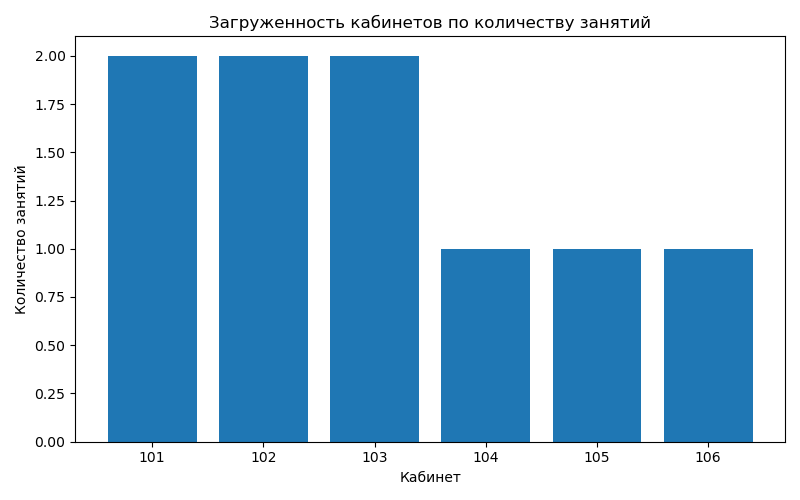

# Анализ загруженности кабинетов по расписанию

Небольшой учебный проект на Python, демонстрирующий базовые навыки анализа данных и визуализации.

## 📌 Описание

Цель — проанализировать загруженность кабинетов в школьном расписании и построить график, показывающий, какие кабинеты используются чаще всего.

## 📊 Используемые технологии

- Python
- Pandas
- Matplotlib

## 📁 Данные

В проекте используется искусственный набор данных с информацией о:
- Классе
- Предмете
- Дне недели
- Кабинете
- Времени занятия

## 🔍 Визуализация

На выходе скрипт строит столбчатую диаграмму, отображающую количество занятий в каждом кабинете.

## 📎 Пример графика

## 📂 Файлы
- `analyze_schedule.py` — скрипт анализа и визуализации
- `загруженность_кабинетов.png` — пример графика
- `README.md` — описание проекта

## ✍️ Автор
Ольга Крышина
# schedule-analysis
Учебный проект по анализу расписаний
